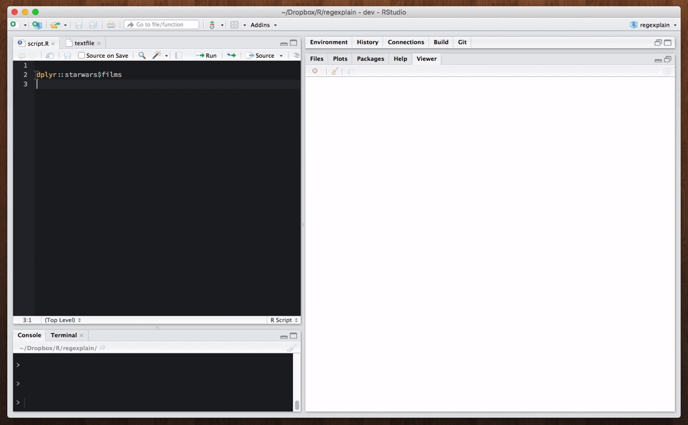
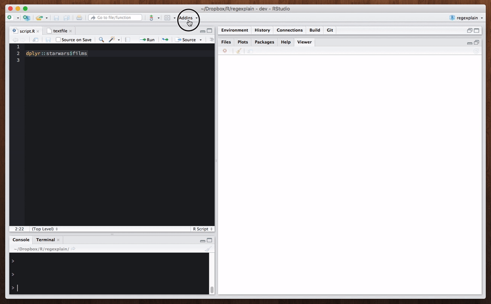
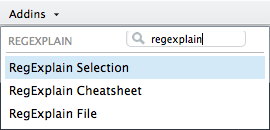
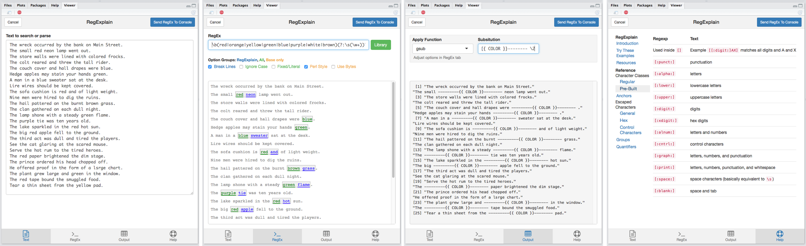
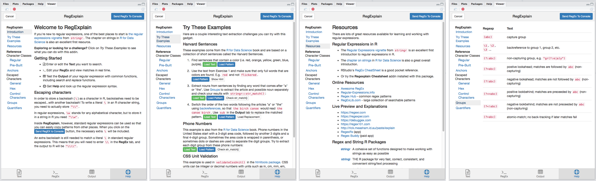
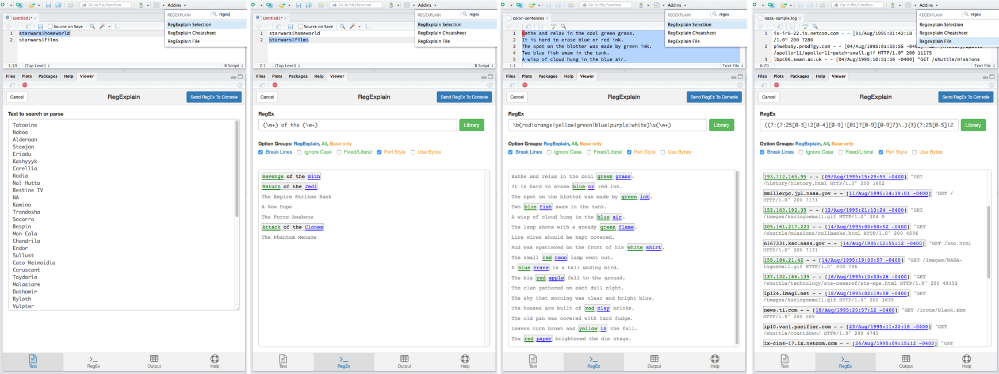
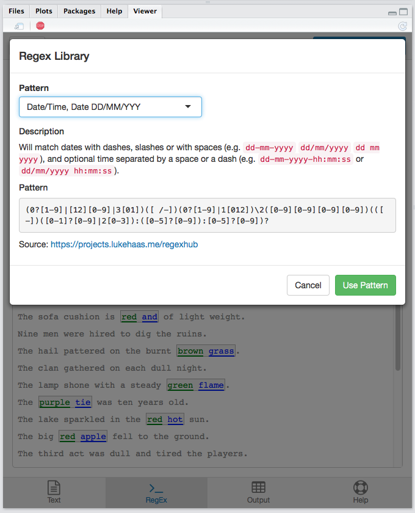
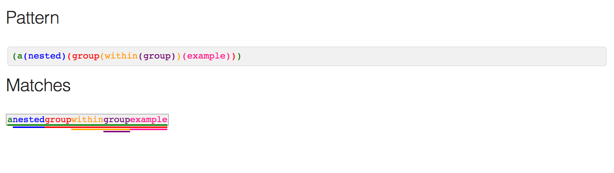

```{r setup, include=FALSE}
knitr::opts_chunk$set(echo = TRUE, fig.path = "man/figures/Readme-")
library(regexplain)
```

#### *Regular expressions are tricky.* RegExplain *makes it easier to see what you're doing.*

<!-- [](commits/master) -->

[](http://www.repostatus.org/#active)
[](https://cran.r-project.org/package=regexplain)
<!-- [)`-yellowgreen.svg)](/commits/master) -->

<!-- Links -->
[regexr]: https://regexr.com/

**RegExplain** is an RStudio addin slash utility belt for regular expressions.
Interactively build your regexp, check the output of common string matching functions, consult the interactive help pages, or use the included resources to learn regular expressions.
And more.

Inspired by [RegExr.com][regexr] and `stringr::str_view()`.

## Installation

Installation is easy with `devtools`

```r
devtools::install_github("gadenbuie/regexplain")
```

or for hands-free installation

```
source("https://install-github.me/gadenbuie/regexplain")
```

## RegExplain in Action

#### Overview



#### Regular Expressions Library



#### Try the Built-In Examples


## RStudio Addin

The main feature of this package is the RStudio Addin **RegExplain Selection**.
Just select the text or object containing text (such as the variable name of a vector or a data.frame column) and run **RegExplain Selection** from the RStudio Addins dropdown.



The addin will open an interface with 4 panes where you can

- edit the **text** you've imported
- build up a **regex** expression and interactively see it applied to your text
- test the **output** of common string matching and replacement functions from `base` and `stringr`
- and refer to a **help**ful cheatsheet



When you're done, click on the **Send Regex to Console** to send your regex expression to... the console!

```r
> pattern <- "\\b(red|orange|yellow|green|blue|purple|white|brown)(?:\\s(\\w+))?"
```

Notice that _RegExplain_ handled the extra backslashes needed for storing the RegEx characters `\b`, `\s`, and `\w`.
Inside the gadget you can use regular old regular expressions as you found them in the wild (hello, [Stack Overflow](https://stackoverflow.com/questions/tagged/regex)!).

### Help and Cheat Sheet

The **Help** tab is full of resources, guides, and R packages and includes an easy-to-navigate reference of commonly used regular expression syntax.



Open **RegExplain Cheatsheet** from the RStudio Addins drop down to open the regex reference page in the Viewer pane without blocking your current R session.

### Import Your Text

There are two ways to get your text into *RegExplain*.
The first way was described above: select an object name or lines of text or code in the RStudio source pane and run **RegExplain Selection**.
To import text from a file, use **RegExplain File** to you import the text you want to process with regular expressions.

When importing text, _RegExplain_ automatically reduces the text to the unique entries and limits the number of lines.



### Regular Expressions Library

The _RegExplain_ gadget includes a regular expressions library in the **RegEx** tab.
The library features common regular expressions, sourced from [qdapRegex](https://github.com/trinker/qdapRegex) and [Regex Hub](https://projects.lukehaas.me/regexhub), with several additional patterns.

The full library is stored as a JSON file in [inst/extdata/patterns.json](/inst/extdata/patterns.json), feel free to contribute patterns you find useful or use regularly via pull request.



## View Static Regex Results

_RegExplain_ provides the function `view_regex()` that you can use as a `stringr::str_view()` replacement.
In addition to highlighting matched portions of the text, `view_regex()` colorizes groups and attempts to colorize the regex expression itself as well.

```r
text <- c("breakfast=eggs;lunch=pizza",
          "breakfast=bacon;lunch=spaghetti", 
          "no food here")
pattern <- "((\\w+)=)(\\w+).+(ch=s?p)"

view_regex(text, pattern)
```


```r
t_nested <- "anestedgroupwithingroupexample"
r_nested <- "(a(nested)(group(within(group))(example)))"
view_regex(t_nested, r_nested)
```




## Notes

Regular expressions are nothing if not a collection of corner cases.
Trying to pass regular expressions through Shiny and HTML inputs is a bit of a labyrinth.
For now, assume any issues or oddities you experience with this addin are entirely my fault and have nothing to do with the fine packages this addin is built on.
If you do find an issue, [please file an issue](https://github.com/gadenbuie/regexplain).
Pull requests are welcomed!
